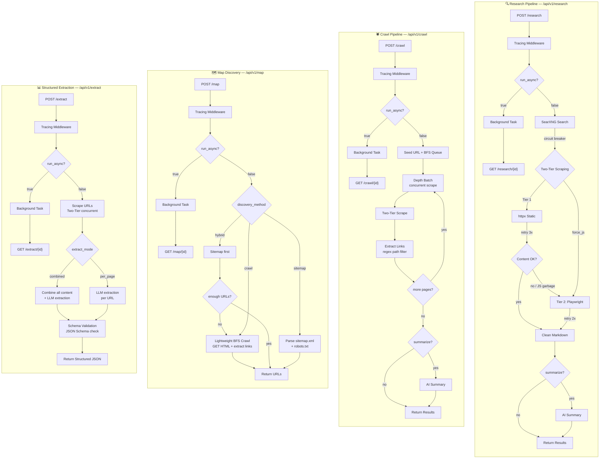

# CHIPER — H.A.K.I.

**C**ontent **H**arvesting, **I**ntegration, **P**arsing, and **E**xtraction **R**outine

> *Headless Asynchronous Knowledge Integrator — v1.3.0*

A Python/FastAPI middleware API that bridges AI agents with SearXNG for automated web research. Extracts clean Markdown content from static and JavaScript-heavy pages using a Two-Tier strategy with **auto JS garbage detection**. Now with **recursive multi-page crawl** — start from one URL and follow internal links depth-by-depth, **site map discovery** — auto-discover every URL on a website via sitemap.xml parsing or lightweight crawl, and **structured data extraction** — extract specific fields from web pages using AI with JSON Schema validation. Supports **synchronous** mode (all steps run inline, summary returned directly) and **full async/background** mode (entire pipeline runs in background, poll for results). Full observability + reliability: JSON logging, X-Request-ID tracing, Prometheus metrics, retry+backoff, circuit breaker, rate limiting, connection pool reuse, browser pool, configurable search categories, and domain filtering for non-scrapable media sites.

---

## 🏗️ Architecture



---

## 🛠️ Tech Stack

| Component | Technology |
|-----------|------------|
| **Framework** | FastAPI + Uvicorn |
| **Search Engine** | SearXNG (self-hosted, JSON API) |
| **Static Fetch** | `httpx` (async, shared connection pool) |
| **Dynamic Render** | `playwright` (headless Chromium, browser pool) |
| **Content Extractor** | `trafilatura` + `markdownify` |
| **AI Summarization** | `openai` SDK → OpenAI-compatible API (DeepSeek, GPT, Claude, etc.) |
| **AI Extraction** | Structured JSON output via OpenAI-compatible API + `jsonschema` validation |
| **Reliability** | Retry+backoff, circuit breaker, rate limiting (`slowapi`), browser pool |
| **Background Tasks** | `asyncio.create_task` + in-memory task store |
| **Structured Logging** | JSON logs with trace context |
| **Metrics** | Prometheus |
| **Deployment** | Docker + Docker Compose |

---

## 📁 Project Structure

```
CHIPER/
├── app/
│   ├── main.py                  # FastAPI entry + lifespan (httpx pool, browser pool, circuit)
│   ├── config.py                # Environment-based settings
│   ├── middleware/
│   │   └── tracing.py           # X-Request-ID middleware
│   ├── models/
│   │   └── schemas.py           # Pydantic request/response validation
│   ├── api/
│   │   └── routes.py            # POST /research + /crawl + /map + /extract endpoints
│   ├── services/
│   │   ├── searxng.py           # SearXNG JSON API integration
│   │   ├── scraper.py           # Two-Tier scraping + JS garbage detection + browser pool
│   │   ├── crawler.py           # BFS recursive crawl engine
│   │   ├── discovery.py         # Site map discovery engine (sitemap + lightweight crawl)
│   │   ├── extractor.py         # Structured data extraction engine (AI + JSON Schema)
│   │   └── summarizer.py        # AI summarization (OpenAI-compatible LLM)
│   └── utils/
│       ├── helpers.py           # Re-export logging utilities
│       ├── logging.py           # Structured JSON logging + trace context
│       ├── metrics.py           # Prometheus metrics definitions
│       ├── circuit_breaker.py   # 3-state circuit breaker
│       ├── links.py             # URL normalization + internal link extraction
│       ├── sitemap.py           # Sitemap XML parser (urlset + sitemap index + robots.txt)
│       └── task_store.py        # In-memory background task store
├── searxng/
│   └── settings.yml             # SearXNG configuration
├── Dockerfile                   # CHIPER image build
├── docker-compose.yml           # All-in-one: DoH proxy + SearXNG + CHIPER
├── requirements.txt             # Python dependencies
├── IMPROVEMENT.md               # Improvement roadmap
├── .env.example                 # Environment variables template
└── .env                         # Environment variables (private)
```

---

## 🚀 Quick Start (Docker — Recommended)

```bash
git clone https://github.com/zeinhasan/CHIPER && cd CHIPER
cp .env.example .env    # fill in CMD_API_KEY and CMD_BASE_URL
docker compose up -d --build
```

Once running:
- **CHIPER API**: http://localhost:8000
- **SearXNG**: http://localhost:8081
- **Swagger Docs**: http://localhost:8000/docs
- **Health**: http://localhost:8000/health
- **Metrics**: http://localhost:8000/metrics

---

## 📡 API Reference

### `POST /api/v1/research`

Executes the research pipeline. Supports two modes:
- **Synchronous** (`run_async: false`, default): All steps run immediately. If `generate_summary: true`, the AI summary is returned directly in the response (no polling needed).
- **Async** (`run_async: true`): Entire pipeline (search + scrape + summary) runs as background task. Returns `task_id` immediately. Poll `GET /research/{task_id}` for full result.

#### Request

```json
{
  "query": "Latest financial reports from tech companies",
  "max_results": 5,
  "force_js_render": false,
  "generate_summary": true,
  "run_async": false
}
```

| Field | Type | Default | Description |
|-------|------|---------|-------------|
| `query` | string | — | Search query *(required)* |
| `max_results` | int | `5` | Maximum URLs to scrape (1–20) |
| `force_js_render` | bool | `false` | Skip Tier-1 for all URLs |
| `generate_summary` | bool | `false` | Generate AI summary. Runs synchronously when `run_async: false` (summary returned directly). |
| `run_async` | bool | `false` | Run entire pipeline as background task. Returns `task_id` immediately. Poll `GET /research/{task_id}` for full result. |

#### Response — With Summary (Sync Mode)

When `run_async: false` and `generate_summary: true`, the summary is returned directly:

```json
{
  "query": "DSSA Anjlok",
  "ai_summary": "PT Dian Swastatika Sentosa Tbk (DSSA) membukukan laba bersih...",
  "results": [{
    "url": "https://...",
    "title": "Saham DSSA Anjlok...",
    "fetch_method": "httpx",
    "markdown_content": "PT Dian Swastatika...",
    "content_length": 3116
  }],
  "total_results": 5
}
```

| Field | Description |
|-------|-------------|
| `query` | Original search query |
| `task_id` | Background task ID (only populated when `run_async: true`) |
| `ai_summary` | AI summary (populated when `generate_summary: true`; null otherwise) |
| `results[].url` | Scraped URL |
| `results[].title` | Title from SearXNG |
| `results[].fetch_method` | `httpx` or `playwright` |
| `results[].markdown_content` | Clean extracted Markdown |
| `total_results` | Total scraped results |

### `GET /api/v1/research/{task_id}`

Poll for the result of a background full-research task (used with `run_async: true`).

| `status` | Meaning |
|----------|---------|
| `processing` | Task is still being processed |
| `done` | Task is ready — `results`, `total_results`, and `ai_summary` are populated |
| `error` | Task failed (error message in `ai_summary`) |
| `not_found` | Task ID not found or expired |

### `POST /api/v1/crawl`

Recursively crawl a website, following same-domain internal links and extracting clean Markdown from every page. Built on the Two-Tier scraping engine.

Supports two modes:
- **Synchronous** (`run_async: false`, default): Crawl runs immediately, returns full results.
- **Async** (`run_async: true`): Crawl runs as background task. Returns `task_id` immediately. Poll `GET /crawl/{task_id}` for results.

#### Request

```json
{
  "url": "http://quotes.toscrape.com",
  "max_depth": 2,
  "max_pages": 10,
  "include_paths": ["/tag/.*"],
  "exclude_paths": ["/login.*"],
  "force_js_render": false,
  "generate_summary": false,
  "run_async": false
}
```

| Field | Type | Default | Description |
|-------|------|---------|-------------|
| `url` | string | — | Starting URL to crawl *(required)* |
| `max_depth` | int | `3` | Maximum crawl depth from base URL (1–10) |
| `max_pages` | int | `20` | Maximum total pages to crawl (1–100) |
| `include_paths` | list\[string\] | `[]` | Regex patterns for path whitelist |
| `exclude_paths` | list\[string\] | `[]` | Regex patterns for path blacklist |
| `force_js_render` | bool | `false` | Use Playwright for all pages (skip Tier-1) |
| `generate_summary` | bool | `false` | Generate AI summary of all crawled content |
| `run_async` | bool | `false` | Run crawl as background task |

#### Response (Sync Mode)

```json
{
  "base_url": "http://quotes.toscrape.com",
  "total_pages": 5,
  "results": [
    {
      "url": "http://quotes.toscrape.com",
      "title": "Quotes to Scrape",
      "depth": 0,
      "fetch_method": "httpx",
      "markdown_content": "# Quotes to Scrape\n\n...",
      "content_length": 2890,
      "links_found": 46
    }
  ],
  "task_id": null,
  "ai_summary": null
}
```

| Field | Description |
|-------|-------------|
| `base_url` | Starting URL (normalized) |
| `total_pages` | Number of successfully crawled pages |
| `results[].url` | Page URL |
| `results[].depth` | Depth level from seed (0 = seed) |
| `results[].fetch_method` | `httpx` or `playwright` |
| `results[].links_found` | Number of internal links discovered |
| `results[].markdown_content` | Clean extracted Markdown |
| `task_id` | Background task ID (only when `run_async: true`) |
| `ai_summary` | AI summary (only when `generate_summary: true`) |

### `GET /api/v1/crawl/{task_id}`

Poll for the result of a background crawl task (used with `run_async: true`).

| `status` | Meaning |
|----------|---------|
| `processing` | Task is still being processed |
| `done` | Task is ready — `base_url`, `total_pages`, `results`, `ai_summary` populated |
| `error` | Task failed (error message in `ai_summary`) |
| `not_found` | Task ID not found or expired |

### `POST /api/v1/map`

Discover all URLs on a website. Does **not** scrape content — purely discovers URLs. Ideal before bulk scraping to understand site structure.

Supports three discovery methods:
- **`sitemap`** — Parse `sitemap.xml` (and sitemap index) for instant discovery. Fast, low-cost.
- **`crawl`** — Lightweight BFS link-follower (GET HTML → extract `<a href>` → move on). No content scraping, no JS rendering.
- **`hybrid`** (default) — Sitemap first, then crawl to fill gaps. Best of both worlds.

Supports **synchronous** (`run_async: false`, default) and **async** (`run_async: true`) with polling via `GET /map/{task_id}`.

#### Request

```json
{
  "url": "https://docs.example.com",
  "discovery_method": "hybrid",
  "max_urls": 100,
  "max_depth": 3,
  "include_paths": ["^/docs/", "^/api/"],
  "exclude_paths": ["^/admin/", "\\.pdf$"],
  "include_subdomains": false,
  "ignore_query_params": false,
  "run_async": false
}
```

| Field | Type | Default | Description |
|-------|------|---------|-------------|
| `url` | string | — | Base URL to discover *(required)* |
| `discovery_method` | string | `"hybrid"` | `"sitemap"`, `"crawl"`, or `"hybrid"` |
| `max_urls` | int | `500` | Maximum URLs to return (1–5000) |
| `max_depth` | int | `10` | Maximum crawl depth (crawl/hybrid only, 1–20) |
| `include_paths` | list\[string\] | `[]` | Regex patterns for path whitelist |
| `exclude_paths` | list\[string\] | `[]` | Regex patterns for path blacklist |
| `include_subdomains` | bool | `false` | Treat subdomains as internal (e.g. `blog.example.com`) |
| `ignore_query_params` | bool | `false` | Strip `?query=...` before dedup |
| `run_async` | bool | `false` | Run as background task |

#### Response (Sync Mode)

```json
{
  "base_url": "https://docs.example.com",
  "total_urls": 42,
  "urls": [
    {
      "url": "https://docs.example.com/intro",
      "path": "/intro",
      "depth": 1,
      "source": "sitemap",
      "last_modified": "2025-06-15T08:00:00Z"
    },
    {
      "url": "https://docs.example.com/guide/install",
      "path": "/guide/install",
      "depth": 2,
      "source": "crawl",
      "last_modified": null
    }
  ],
  "sitemap_url": "https://docs.example.com/sitemap.xml",
  "discovery_method": "hybrid",
  "sitemap_count": 30,
  "crawl_count": 12,
  "task_id": null
}
```

| Field | Description |
|-------|-------------|
| `base_url` | Starting URL (normalized) |
| `total_urls` | Total unique URLs discovered |
| `urls[].url` | Full canonical URL |
| `urls[].path` | Path only (no scheme/host) |
| `urls[].depth` | Distance from seed URL (0 = seed) |
| `urls[].source` | `"sitemap"` or `"crawl"` |
| `urls[].last_modified` | ISO-8601 from `<lastmod>` in sitemap (if available) |
| `sitemap_url` | Discovered sitemap URL (if found) |
| `sitemap_count` | URLs discovered via sitemap |
| `crawl_count` | URLs discovered via crawl |
| `discovery_method` | Method used (`sitemap`, `crawl`, or `hybrid`) |
| `task_id` | Background task ID (only when `run_async: true`) |

### `GET /api/v1/map/{task_id}`

Poll for the result of a background map discovery task (used with `run_async: true`).

| `status` | Meaning |
|----------|---------|
| `processing` | Task is still being processed |
| `done` | Task is ready — `base_url`, `total_urls`, `urls`, `sitemap_url` populated |
| `error` | Task failed (error message in `base_url`) |
| `not_found` | Task ID not found or expired |

### `POST /api/v1/extract`

Extract structured data from one or more URLs using an OpenAI-compatible LLM (DeepSeek, GPT, Claude, etc.).

Supports two extraction modes:
- **`combined`** (default) — All pages are scraped, content combined, **one** LLM call for extraction. Best for pages that complement each other (e.g. pricing tiers across subpages).
- **`per_page`** — Each URL is scraped and extracted independently. Best for pages with different structures.

Each mode supports two extraction methods:
- **Prompt-only** — Describe what to extract in natural language. LLM returns structured JSON automatically.
- **Schema mode** — Provide a JSON Schema. LLM returns JSON that is validated against the schema.

Supports **synchronous** (`run_async: false`, default) and **async** (`run_async: true`) with polling via `GET /extract/{task_id}`.

#### Request

```json
{
  "urls": [
    "https://example.com/pricing"
  ],
  "prompt": "Extract all pricing plans with name, price, billing period, and key features.",
  "json_schema": {
    "type": "object",
    "properties": {
      "plans": {
        "type": "array",
        "items": {
          "type": "object",
          "properties": {
            "name": { "type": "string" },
            "price": { "type": "string" },
            "billing": { "type": "string" },
            "features": { "type": "array", "items": { "type": "string" } }
          },
          "required": ["name", "price"]
        }
      }
    },
    "required": ["plans"]
  },
  "extract_mode": "combined",
  "force_js_render": false,
  "run_async": false
}
```

| Field | Type | Default | Description |
|-------|------|---------|-------------|
| `urls` | list\[string\] | — | URLs to extract data from *(required, 1–20)* |
| `prompt` | string | — | Natural-language description of data to extract *(required, 10–2000 chars)* |
| `json_schema` | object\|null | `null` | JSON Schema to validate the extracted data |
| `extract_mode` | string | `"combined"` | `"combined"` or `"per_page"` |
| `force_js_render` | bool | `false` | Use Playwright for all pages (skip Tier-1) |
| `run_async` | bool | `false` | Run extraction as background task |

#### Response (Sync Mode)

```json
{
  "success": true,
  "data": [
    {
      "url": "https://example.com/pricing",
      "extraction": {
        "plans": [
          {
            "name": "Starter",
            "price": "$19/mo",
            "billing": "monthly",
            "features": ["5 projects", "10 GB storage"]
          },
          {
            "name": "Pro",
            "price": "$49/mo",
            "billing": "monthly",
            "features": ["Unlimited projects", "100 GB storage"]
          }
        ]
      },
      "error": null
    }
  ],
  "total_urls": 1,
  "failed_urls": 0,
  "extract_mode": "combined",
  "task_id": null
}
```

| Field | Description |
|-------|-------------|
| `success` | `true` if all URLs extracted successfully |
| `data[].url` | URL that was extracted |
| `data[].extraction` | Extracted data in JSON format (null if failed) |
| `data[].error` | Error message if extraction failed for this URL |
| `total_urls` | Total URLs processed |
| `failed_urls` | Number of URLs that failed |
| `extract_mode` | Mode used (`combined` or `per_page`) |
| `task_id` | Background task ID (only when `run_async: true`) |

### `GET /api/v1/extract/{task_id}`

Poll for the result of a background extraction task (used with `run_async: true`).

| `status` | Meaning |
|----------|---------|
| `processing` | Task is still being processed |
| `done` | Task is ready — `success`, `data`, `total_urls`, `failed_urls`, `extract_mode` populated |
| `error` | Task failed |
| `not_found` | Task ID not found or expired |

### `GET /health`

```json
{ "status": "ok", "version": "1.3.0" }
```

### `GET /metrics`

Exposes Prometheus metrics (OpenMetrics format).

---

## ⚙️ Environment Variables

| Variable | Default | Description |
|----------|---------|-------------|
| `SEARXNG_BASE_URL` | `http://localhost:8080` | SearXNG instance URL |
| `SEARXNG_CATEGORIES` | `web,news` | SearXNG search categories (comma-separated). Default excludes videos, images, and files. |
| `CMD_API_KEY` | — | API key for AI summarization *(required)* |
| `CMD_BASE_URL` | `https://openrouter.ai/api/v1` | OpenAI-compatible API base URL |
| `CMD_MODEL` | `deepseek/deepseek-chat` | Model name for AI (OpenAI-compatible format) |
| `PLAYWRIGHT_BROWSER_PATH` | *(auto)* | Custom Chromium binary path |
| `BROWSER_POOL_SIZE` | `2` | Number of Chromium instances (round-robin) |
| `HOST` | `0.0.0.0` | Server host binding |
| `PORT` | `8000` | Server port |
| `LOG_FORMAT` | `json` | `json` (structured) or `console` |
| `LOG_LEVEL` | `INFO` | `DEBUG`, `INFO`, `WARNING`, `ERROR` |
| `MIN_CONTENT_LENGTH` | `200` | Min chars for Tier-1 sufficiency |
| `FETCH_STATIC_RETRIES` | `3` | Max httpx retry attempts |
| `FETCH_DYNAMIC_RETRIES` | `2` | Max Playwright retry attempts |
| `FETCH_RETRY_BASE_DELAY` | `1.0` | Base delay for exponential backoff |
| `CIRCUIT_BREAKER_FAILURES` | `5` | Failures before opening SearXNG circuit |
| `CIRCUIT_BREAKER_TIMEOUT` | `30.0` | Seconds before half-opening circuit |
| `RATE_LIMIT` | `30/minute` | Max requests per IP |
| `CRAWL_RATE_LIMIT` | `5/minute` | Max crawl requests per IP |
| `CRAWL_MAX_CONCURRENT` | `5` | Max concurrent scrapes per crawl |
| `CRAWL_DELAY_MS` | `500` | Per-page delay in milliseconds |
| `MAP_MAX_CONCURRENT` | `10` | Max concurrent requests during map discovery |
| `MAP_DELAY_MS` | `200` | Per-page delay during map discovery (milliseconds) |
| `EXTRACT_MAX_URLS` | `20` | Max URLs per extraction request |
| `EXTRACT_MAX_CONTENT_CHARS` | `8000` | Max content chars per URL sent to LLM |
| `EXTRACT_TEMPERATURE` | `0.1` | LLM temperature (lower = more deterministic) |
| `EXTRACT_RETRIES` | `1` | Retries if LLM returns invalid JSON (schema mode) |

---

## 🔄 Two-Tier Scraping Flow

```
URL received → force_js_render?
    |
    +-- false → Tier 1: httpx (retry 3x, exponential backoff)
    |              +-- content >= 200 chars AND not JS garbage → DONE
    |              +-- otherwise → fallback to Tier 2
    |
    +-- true  → Tier 2: Playwright (retry 2x, exponential backoff)
                   +-- browser pool: N instances, round-robin
                   +-- block images/CSS/fonts
                   +-- wait network idle
                   +-- extract rendered HTML

HTML → trafilatura → Clean Markdown
```

---

## 🧪 Example cURL Requests

```bash
# Quick research (no summary, <5s)
curl -X POST http://localhost:8000/api/v1/research \
  -H "Content-Type: application/json" \
  -d '{"query": "DSSA Anjlok", "max_results": 3}'

# Research + summary (synchronous, returns summary directly)
curl -X POST http://localhost:8000/api/v1/research \
  -H "Content-Type: application/json" \
  -d '{"query": "DSSA Anjlok", "max_results": 5, "generate_summary": true}'

# Full async research (entire pipeline in background, instant return)
curl -X POST http://localhost:8000/api/v1/research \
  -H "Content-Type: application/json" \
  -d '{"query": "DSSA Anjlok", "max_results": 5, "run_async": true}'

# Poll for async research result
curl http://localhost:8000/api/v1/research/abc-123

# Force Playwright
curl -X POST http://localhost:8000/api/v1/research \
  -H "Content-Type: application/json" \
  -d '{"query": "React 19 features", "max_results": 3, "force_js_render": true}'

# ── Crawl ────────────────────────────────────────────

# Basic crawl (depth 1, max 3 pages)
curl -X POST http://localhost:8000/api/v1/crawl \
  -H "Content-Type: application/json" \
  -d '{"url": "http://quotes.toscrape.com", "max_depth": 1, "max_pages": 3}'

# Crawl with path whitelist (only /tag/ pages)
curl -X POST http://localhost:8000/api/v1/crawl \
  -H "Content-Type: application/json" \
  -d '{"url": "http://quotes.toscrape.com", "max_depth": 2, "max_pages": 15, "include_paths": ["/tag/.*"]}'

# Async crawl (returns task_id immediately)
curl -X POST http://localhost:8000/api/v1/crawl \
  -H "Content-Type: application/json" \
  -d '{"url": "http://quotes.toscrape.com", "max_depth": 1, "max_pages": 5, "run_async": true}'

# Poll for async crawl result
curl http://localhost:8000/api/v1/crawl/{task_id}

# Crawl + AI summary
curl -X POST http://localhost:8000/api/v1/crawl \
  -H "Content-Type: application/json" \
  -d '{"url": "http://quotes.toscrape.com", "max_depth": 1, "max_pages": 5, "generate_summary": true}'

# ── Map Discovery ────────────────────────────────────

# Quick map discovery (hybrid mode — sitemap + crawl)
curl -X POST http://localhost:8000/api/v1/map \
  -H "Content-Type: application/json" \
  -d '{"url": "http://quotes.toscrape.com", "max_urls": 50}'

# Sitemap-only (fastest, relies on site's sitemap.xml)
curl -X POST http://localhost:8000/api/v1/map \
  -H "Content-Type: application/json" \
  -d '{"url": "http://quotes.toscrape.com", "discovery_method": "sitemap", "max_urls": 100}'

# Crawl-only (no sitemap, lightweight link-following)
curl -X POST http://localhost:8000/api/v1/map \
  -H "Content-Type: application/json" \
  -d '{"url": "http://quotes.toscrape.com", "discovery_method": "crawl", "max_urls": 50, "max_depth": 2}'

# Map with path filters (only /tag/ pages, exclude /login)
curl -X POST http://localhost:8000/api/v1/map \
  -H "Content-Type: application/json" \
  -d '{"url": "http://quotes.toscrape.com", "discovery_method": "hybrid", "max_urls": 100, "include_paths": ["/tag/.*"], "exclude_paths": ["/login.*"]}'

# Async map discovery (returns task_id immediately)
curl -X POST http://localhost:8000/api/v1/map \
  -H "Content-Type: application/json" \
  -d '{"url": "http://quotes.toscrape.com", "max_urls": 200, "run_async": true}'

# Poll for async map result
curl http://localhost:8000/api/v1/map/{task_id}

# ── Structured Data Extraction ──────────────────

# Quick extraction — quotes.toscrape.com (prompt-only)
curl -X POST http://localhost:8000/api/v1/extract \
  -H "Content-Type: application/json" \
  -d '{"urls": ["http://quotes.toscrape.com"], "prompt": "Extract all quotes with their text and author"}'

# Extraction with JSON Schema — books.toscrape.com (validated output)
curl -X POST http://localhost:8000/api/v1/extract \
  -H "Content-Type: application/json" \
  -d '{
    "urls": ["http://books.toscrape.com"],
    "prompt": "Extract all books with title and price",
    "json_schema": {
      "type": "object",
      "properties": {
        "books": {
          "type": "array",
          "items": {
            "type": "object",
            "properties": {
              "title": {"type": "string"},
              "price": {"type": "string"}
            },
            "required": ["title", "price"]
          }
        }
      },
      "required": ["books"]
    }
  }'

# Multi-URL per_page — two different sites
curl -X POST http://localhost:8000/api/v1/extract \
  -H "Content-Type: application/json" \
  -d '{"urls": ["http://quotes.toscrape.com", "http://books.toscrape.com"], "prompt": "Extract the page title and summary", "extract_mode": "per_page"}'

# Async extraction (returns task_id immediately)
curl -X POST http://localhost:8000/api/v1/extract \
  -H "Content-Type: application/json" \
  -d '{"urls": ["http://quotes.toscrape.com"], "prompt": "Extract all quotes with text and author", "run_async": true}'

# Poll for async extraction result
curl http://localhost:8000/api/v1/extract/{task_id}
```

---

## 📝 License

MIT License — see [LICENSE](LICENSE).
